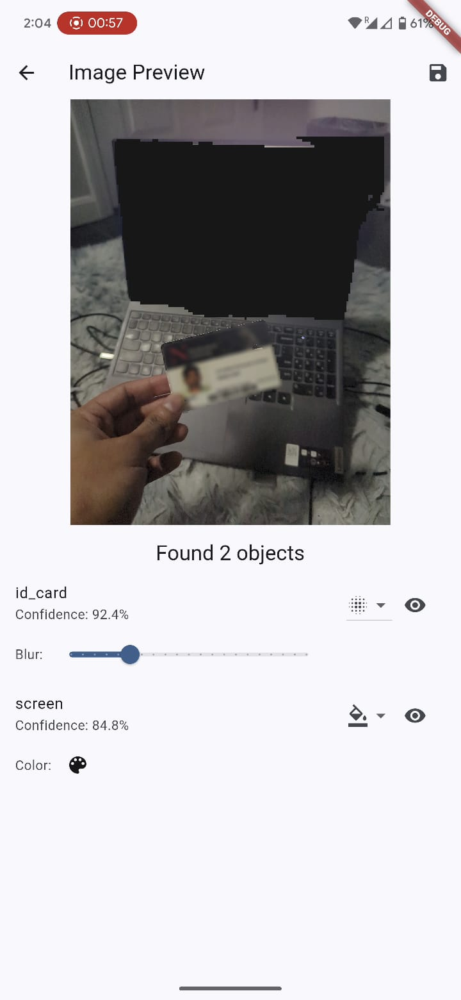
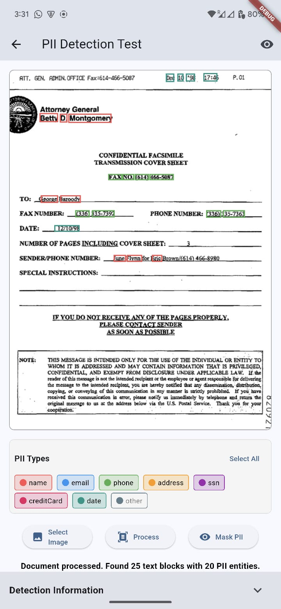

# Perception Privacy Mobile App

A Flutter mobile application that provides privacy-preserving image processing and personally identifiable information (PII) detection and masking.

[▶️ Watch HD Demo Video](https://drive.google.com/file/d/1Wg6H7nlFEPd18XLu00qxTY9iWk__ZPfS/view?usp=sharing)


## Overview

Perception Privacy is a mobile application designed to enhance privacy protection by detecting and masking sensitive information in both images and documents. The app uses on-device machine learning for object detection and integrates with ChatGPT API for advanced PII detection in text.

## Features

### Image Capture & Selection

- Camera integration for real-time image capture
- Gallery selection for processing existing images
- Image type classification (document vs. regular image)

### Object Detection (For Regular Images)

- Uses YOLO model via TensorFlow Lite to detect privacy-sensitive objects such as:
  - ID cards, Passports, Credit cards
  - Screens
  - License plates
- Interactive mask management with multiple masking options:
  - Overlay (semi-transparent coloring)
  - Solid color fill
  - Blur with adjustable intensity
- Visual feedback with detection confidence scores

### Document Processing (For Text-Based Images)

- Google ML Kit integration for text recognition and extraction
- Word-level bounding box detection
- PII detection using ChatGPT API for identifying:
  - Names
  - Email addresses
  - Phone numbers
  - Physical addresses
  - Social Security Numbers
  - Credit card numbers
  - Dates
- Interactive PII filtering by type
- Customizable masking options

### Image Saving & Sharing

- Export masked images in PNG format
- Image sharing integration with native platforms
- File management utilities

## Technical Implementation

### Architecture

The application follows a clean architecture approach with separation of concerns:

```
lib/
  ├── screens/       # UI screens
  ├── services/      # Core functional services
  ├── models/        # Data models
  ├── widgets/       # Reusable UI components
  ├── config/        # Configuration (API keys, etc.)
  └── main.dart      # Application entry point
```

### Key Components

#### Main Screens

- `HomeScreen`: Initial screen for selecting image source
- `ImageTypeSelectionScreen`: Classification of image as document or regular image
- `ImagePreviewScreen`: For processing regular images with object detection
- `DocumentPreviewScreen`: For processing documents with PII detection

#### Core Models

- `Detection`: Represents detected objects with mask information
- `PIIEntity`: Models personally identifiable information with type and confidence
- `TextBlockWithPII`: Manages text blocks with their associated PII entities
- `TextElementWithPII`: Word-level text elements with PII associations

#### Core Services

- `YoloModelService`: Handles object detection using TensorFlow Lite
- `EnhancedOcrService`: Provides text extraction with Google ML Kit
- `ChatGPTService`: Connects to OpenAI API for PII detection
- `TextPIIMaskingService`: Applies masking to detected PII

#### UI Components

- `MaskOverlayWidget`: Renders object detection masks with interactive controls
- `InteractiveDocumentPreview`: Shows document with PII highlighting/masking
- `DocumentPreviewWidget`: Displays OCR results with PII information

### Key Algorithms

#### Matrix2D Implementation

The app uses a custom `Matrix2D` class for efficient tensor operations:

- Optimized memory usage with `Float32List`
- Region-based operations for mask processing
- Efficient image mask transformations

#### Object Detection Pipeline

1. Image loading and preprocessing
2. YOLO model inference via TensorFlow Lite
3. Processing detection outputs to generate masks
4. Converting masks to interactive overlays

#### PII Detection Pipeline

1. OCR processing to extract text blocks with spatial information
2. Text preprocessing and batching for API efficiency
3. ChatGPT API integration for detecting various PII types
4. Mapping detected PII to text elements and bounding boxes
5. Interactive visualization and masking of detected PII

## Installation

### Requirements

- Flutter SDK 2.0.0 or higher
- Dart 2.12.0 or higher
- An OpenAI API key for ChatGPT integration

### Dependencies

- `flutter/material.dart`: Core Flutter UI framework
- `image_picker`: For selecting images from gallery
- `camera`: For camera integration
- `google_mlkit_text_recognition`: For OCR processing
- `tflite_flutter`: For TensorFlow Lite integration
- `http`: For API communication
- `image`: For image processing
- `path_provider`: For file system operations
- `share_plus`: For sharing processed images
- `permission_handler`: For managing permissions
- `flutter_colorpicker`: For color selection UI

### Setup

1. Clone the repository

   ```bash
   git clone https://github.com/yourusername/perception_privacy_mobile_app.git
   cd perception_privacy_mobile_app
   ```

2. Install dependencies

   ```bash
   flutter pub get
   ```

3. Configure API keys

   ```bash
   cp lib/config/api_keys_template.dart lib/config/api_keys.dart
   ```

   Then edit `api_keys.dart` to add your OpenAI API key.

4. Run the app
   ```bash
   flutter run
   ```

## Usage

### Home Screen

The app starts with a home screen providing two options:

- **Camera**: Capture a new image
- **Gallery**: Select an existing image

### Image Type Selection

After selecting or capturing an image, choose the image type:

- **Document**: For images containing text (forms, IDs, receipts)
- **Regular Image**: For photos and other general images

### Regular Image Processing

For regular images, the app will:

1. Automatically detect privacy-sensitive objects using YOLO
2. Show detected objects with confidence scores
3. Allow applying different mask types (overlay, solid, blur)
4. Provide controls to customize mask appearance
5. Enable saving and sharing the masked image

### Document Processing

For document images, the app will:

1. Extract text using OCR
2. Detect PII in the extracted text via ChatGPT API
3. Highlight detected PII by type
4. Allow filtering PII by category
5. Provide options to mask selected PII
6. Enable saving and sharing the masked document




## Performance Considerations

The app includes several performance optimizations:

- Custom `Matrix2D` implementation for efficient tensor operations
- Batched API requests to minimize network calls
- Vector-based mask rendering for memory efficiency
- Optimized image processing with region-based operations
- Memory management for large image handling

## Contributing

Contributions are welcome! To contribute to this project:

1. Fork the repository
2. Create a feature branch: `git checkout -b feature/new-feature`
3. Commit your changes: `git commit -m 'Add new feature'`
4. Push to the branch: `git push origin feature/new-feature`
5. Submit a pull request

## License

This project is licensed under the MIT License - see the LICENSE file for details.

## Acknowledgments

- [Flutter](https://flutter.dev/) - UI framework
- [TensorFlow Lite](https://www.tensorflow.org/lite) - ML inference
- [Google ML Kit](https://developers.google.com/ml-kit) - Text recognition
- [OpenAI](https://openai.com/) - PII detection
- [Image](https://pub.dev/packages/image) - Image processing library
- [Ultralytics](https://www.ultralytics.com/) - YOLO library
